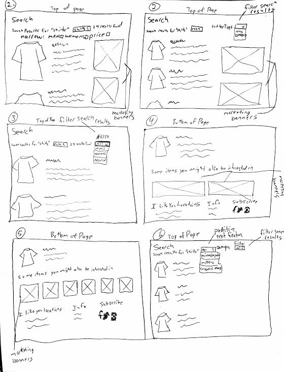
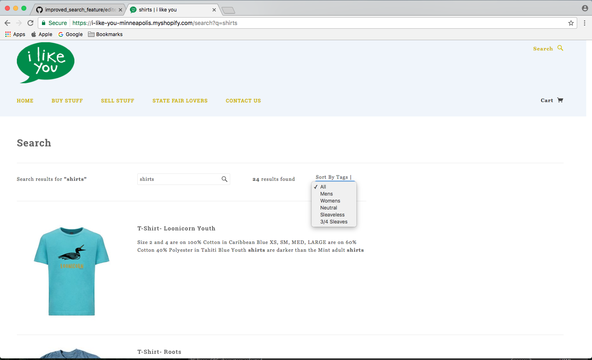
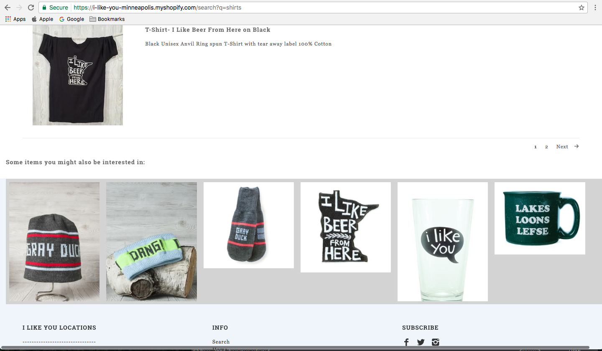

# Improved Search Feature

This repository desplays a redesigned search feature which improves the user experience of a web page.

## The Website
The search feature I chose to improve was for I Like You, a Minnesota-themed boutique with locations in Minneapolis and St. Paul. https://i-like-you-minneapolis.myshopify.com/

## The Problem
I set out to find a website that had a search feature, which was bad from a user experience perspective, and improve the search feature. The search feature on I Like You's website was lacking for several reasons:
1. The search feature did not have a predictive text feature to anticipate what a user wanted as they were typing.
2. The search field did not account for misspellings.
3. The search results could not be further narrowed down after the inital search.
4. After searching, there were no suggestions to inspire what the user might look at next. 

## The Solution
I built a static search results page, which if fully implemented would provide additional features and a better user experience for I Like You's 
search result page. These added features improve a user's ability to find what they are looking for quickly, minimizes frustration, and helps a user discover new products they are interested in, based off of their search. 

## Mockups

The mockups displayed above show my thought process as I was thinking through a solution. Sketches 1, 2, and 4 were not used in the final product. They were part of the process in determining how to arrange the different elements. Sketch 3 highlights the search filter, which lets the user further narrow the results of their search. Sketch 6 highlights the predictive text feature, which generates results based on what the user is typing to help them find what they are looking for more quickly. Sketch 5 highlights the marketing banners, which are displayed below the search results, to show the user other items they may be interested in based off of their search.

## Product Example

## Predictive Text/Misspellings

The predictive text feature was not built out in this static representation of the search results page, but a visual representation can be viewed in sketch 6 of the mockups. The way that this feature would work would be to generate a dropdown list of suggested words below the search bar, which are dynamically generated based off of what the user types. This would help the user more quickly get to the search results that they want. It would also help a user in the case of a physical disability to not have to completely type out their entire search. The predictive text feature would also generate suggestions for words that were slightly misspelled, helping to avoid an empty results page. 

### Search Filter

The code for the search filter can be viewed in the filter_search_results.html file. The filter is not fully functional, but serves as a representation of what would be seen on a fully-engineered page. The purpose of the search filter is to allow the user to narrow their search results, so that they can find the specific item that they are looking for. In the instance of a search for "shirts", the user would then have the ability to sort the search by tags associated with each item. Tags associated with different shirts could be Mens, Womens, Neutral, Sleaveless, and 3/4 Sleaves. The reason that I chose a dropdown menu as the method for narrowing the search was to maintain consistency across the site. On the home page, there is a dropdown menu that allows the user to sort by tags. Also, on the search results page, there generally won't be a large number of tags associated with a given item, and dropdown menu can appropriately contain 5-10 tags. 

### Marketing Banner

The code for the marketing banners can be viewed in the marketing_banners.html file. The purpose of the marketing banners is to allow I Like You to promote content that is relevant to the user's search. In the instance of a search for "shirts", the user would then see below the search results, a series of 6 items that they may be interested in. These results are static, but in a fully-engineered page, would be dymanically engineered based off of tags associated with the items. Items generated in the marketing banners after a search for "shirts" could be a knit hat, a knit headband, a pair of mittens, an iron-on clothing patch, a pint glass, or a ceramic mug. The reason that the banners are located below the search results is to account for the possibility of the website being viewed on a smaller device size. If the screen size is smaller, the banner elements will simply stack. If the banner elements were to the right side of the search results, there is the possibility that if viewed on a smaller device that the banner items would be intermixed with the search results, which could get convoluted.  

 
## Getting Started 

These instructions will get you a copy of the project up and running on your local machine for development and testing purposes.
1. Copy the full code from the edited.html file.
2. Go to https://i-like-you-minneapolis.myshopify.com/search?q=shirts
3. Open Google Chrome, and control + click to open Chrome Developer Tools and click on the "Elements" tab.
4. In the html elements, control + click on the body arrow, then click "Edit as HTML"
5. Paste the edited.html code to replace the current text.
6. Hit command + return to apply the code, and view in browser.

